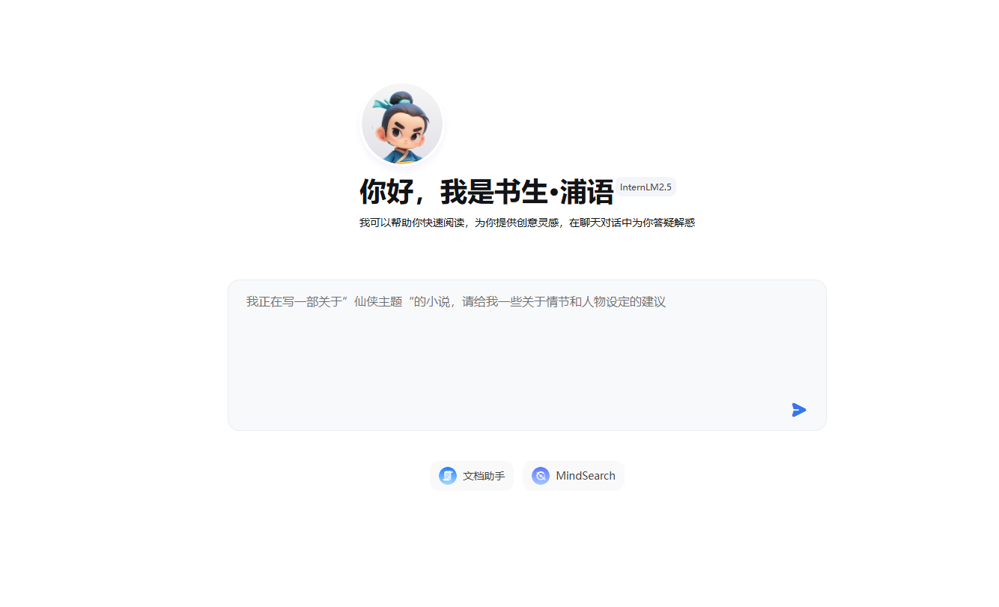

# internLM 介绍

书生浦语大模型(internLM)是由中国的研究团队开发的一款大型语言模型。该模型是继OpenAI的GPT系列、谷歌的BERT等国际知名语言模型之后的又一重要成果,展示了中国在人工智能领域的创新能力和技术实力。

以下是对书生浦语大模型(internLM)的简要介绍:
1. **模型架构**:
   - 书生浦语大模型采用了深度学习技术,具体架构细节可能涉及技术创新点,但通常这类模型会基于Transformer架构,该架构因其强大的并行处理能力和对长距离依赖关系的建模能力而被广泛应用。
2. **训练数据**:
   - 该模型在训练时使用了海量的中文文本数据,包括网络文本、书籍、新闻、文章等,以确保模型能够理解和生成丰富多样的中文内容。
3. **能力与应用**:
   - 书生浦语大模型具备自然语言理解与生成能力,可以用于文本摘要、机器翻译、问答系统、内容创作、情感分析等多个领域。
   - 在理解和生成中文文本方面,书生浦语大模型展现了较高的准确性和流畅性。
4. **技术特点**:
   - 作为一款大型语言模型,书生浦语大模型在处理上下文信息、语法结构、以及语义理解方面表现出色。
   - 它可能还融合了中文特有的语言规则和文化背景知识,使其在处理中文文本时更加精准。
